# TryHackMe - Splunk Dashboards and Reports

## Overview

Splunk is one of the most widely used Security Information and Event Management (SIEM) platforms in enterprise environments. It enables organizations to aggregate logs from multiple sources, investigate security events, build detections, and visualize large volumes of data efficiently.

In this room, I explored how Splunk reports, alerts, and dashboards can be used to improve SOC visibility and streamline security monitoring.

**Lab Link:** https://tryhackme.com/room/splunkdashboardsandreports

---

# Task 1 - Introduction

Large datasets can quickly overwhelm analysts if they rely solely on raw logs. Splunk provides mechanisms such as reports, alerts, and dashboards that transform massive volumes of event data into meaningful insights.

## Learning Objectives

- Create reports for recurring searches
- Build alerts and detection rules
- Create dashboards for visualization
- Understand Splunk Enterprise Security
- Explore Splunk SOAR functionality

---

# Task 2 - Creating Reports for Recurring Searches

## Reviewing Available Data

Before creating reports, it is important to understand the dataset available within Splunk.

### PAYLOAD

```spl
index=*
```

### Explanation

This query searches across every available index and returns all events. It provides a high-level overview of the available data and helps analysts estimate the scope of their investigation.

In this case, more than 10,000 events were present. Manually reviewing such a dataset would be extremely inefficient, which is why reports and dashboards are critical in a SOC environment.

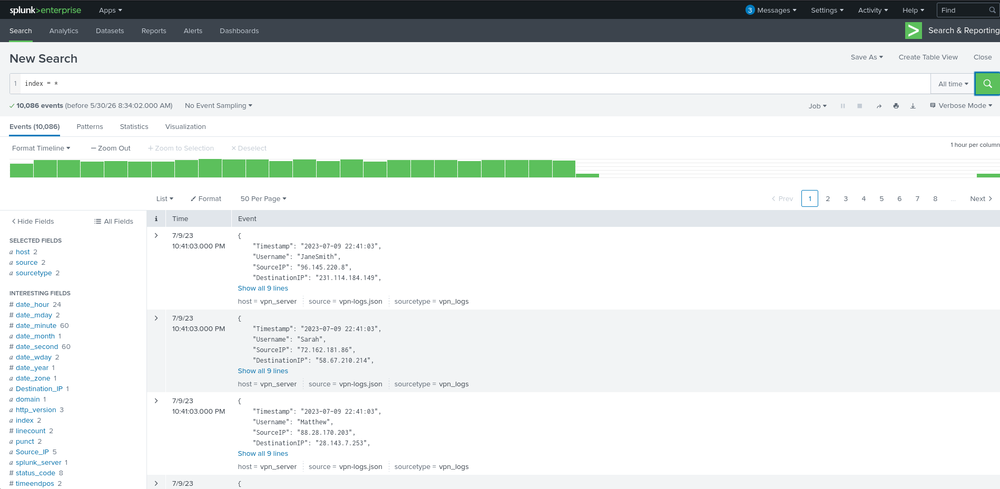

---

## Exploring Existing Reports

Splunk includes several built-in reports that can be reviewed and reused. Existing reports provide useful examples of recurring searches and can often be modified to fit organizational requirements.

Opening a report allows analysts to inspect the results, while the **Open in Search** option reveals the underlying SPL query.

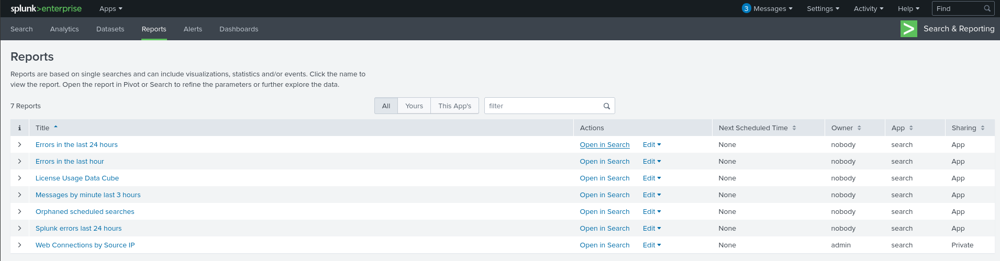

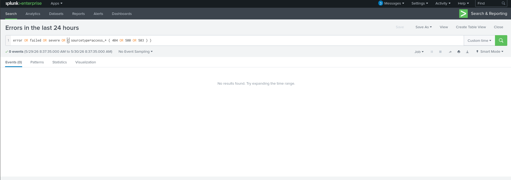

---

## Creating a VPN Login Report

A common SOC requirement is identifying which users generate the most VPN activity. This helps analysts monitor authentication trends and detect potentially suspicious account behavior.

### PAYLOAD

```spl
index=vpn_server
| stats count by Username
| sort - count
```

### Explanation

This query performs three key actions:

- Searches events from the `vpn_server` index.
- Counts events for each username.
- Sorts results from highest to lowest activity.

This quickly highlights the most active VPN users and provides visibility into authentication activity across the environment.

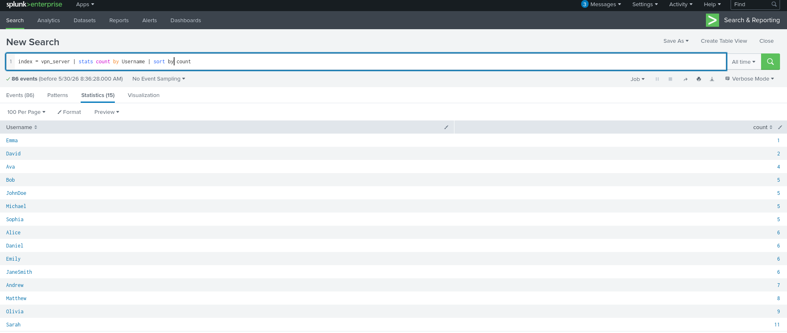

---

## Saving the Report

After validating the search results, the query can be saved as a report.

Saving searches as reports eliminates the need to repeatedly execute the same SPL query and ensures analysts can access the information whenever required.

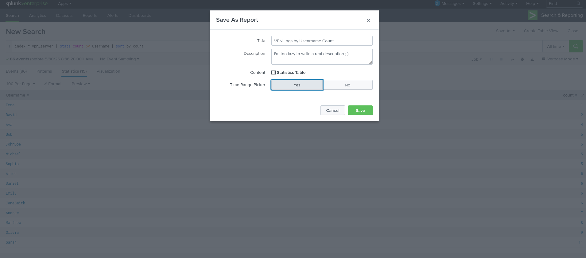

---

## Generated Report

The report now displays VPN activity grouped by username.

Such reports are frequently scheduled within SOC environments to provide recurring visibility into authentication trends and user behavior.

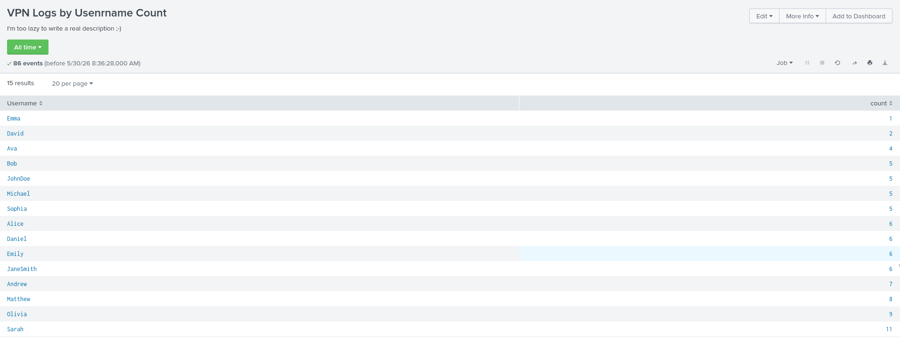

---

## Scheduling Reports

Reports become significantly more valuable when combined with scheduling.

Instead of manually executing searches at the beginning of every shift, SOC teams can configure reports to run automatically at predefined intervals.

Common scheduling use cases include:

- Every 4 hours
- Every 8 hours
- Daily summaries
- Weekly trend analysis

This reduces workload on analysts while maintaining continuous visibility.

---

## Question 1

### Which Source_IP field value recorded the highest number of events?

### Answer

```text
10.0.0.1
```

The **Web Connections by Source IP** report aggregates events based on source addresses, making it easy to identify the most active systems within the environment.

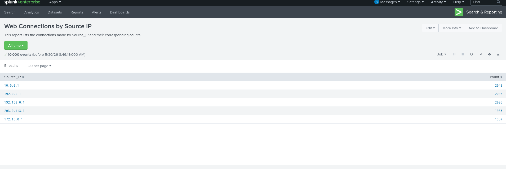

---

## Question 2

While viewing the report, selecting **Edit → Open in Search** reveals the SPL query used to generate the report.

Inspecting existing searches is a useful technique because analysts can learn how reports are constructed and identify hidden information embedded within queries.

### What is the hidden flag?

### Answer

```text
THM{splunk_report_wizard!}
```

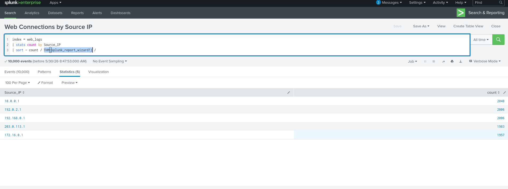

---

# Task 3 - Detecting with Alerts and Searches

Reports provide visibility into historical activity, but alerts provide real-time detection capabilities.

Alerts notify analysts whenever predefined conditions are met, allowing security teams to respond rapidly to suspicious activity.

---

## Reviewing Interesting Resources

Before creating detections, it is important to understand the available data.

While reviewing the `web_logs` index, the URI `/restricted.html` immediately stands out because it appears to reference a potentially sensitive resource.

This makes it a strong candidate for monitoring and alerting.

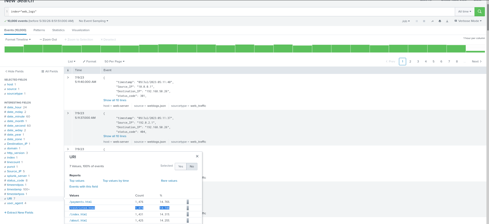

---

## Detecting External Access to Restricted Content

Assume that `/restricted.html` should only be accessed by internal systems.

To identify potentially unauthorized access, we can search for requests originating from outside private network ranges.

### PAYLOAD

```spl
index=web_logs URI=/restricted.html
NOT Source_IP IN (10.0.0.0/8, 172.16.0.0/12, 192.168.0.0/16)
```

### Explanation

This query:

- Searches requests made to `/restricted.html`.
- Excludes RFC1918 private IP ranges.
- Returns only external source addresses.

The logic behind this detection is straightforward:

If a page intended for internal use is being accessed by external systems, the activity should be reviewed immediately.

This type of query can easily be converted into a real-time alert.

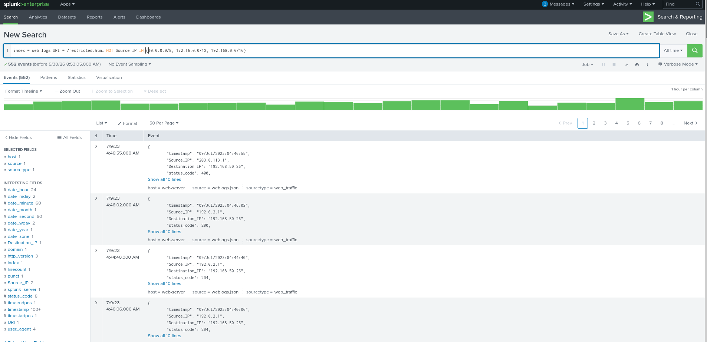

---

## Alert Configuration

After creating the detection query, Splunk allows it to be converted into an alert.

Common alert settings include:

- Real-Time Alerts
- Scheduled Alerts
- Per-Result Triggering
- Threshold Triggering
- Email Notifications
- Webhook Notifications

For this example:

- Alert Type: Real-Time
- Trigger: Per Result
- Action: Send Email

This ensures analysts are immediately notified whenever an unauthorized access attempt occurs.

---

## Investigating Payment Page Activity

Next, the focus shifts toward `/payments.html`.

Before creating detections, we first need to understand normal activity associated with this resource.

### PAYLOAD

```spl
index=web_logs URI=/payments.html
```

### Explanation

This query retrieves all events associated with `/payments.html`.

Reviewing the results reveals multiple HTTP status codes, including successful responses and error responses.

Understanding these patterns is essential before defining alert thresholds.

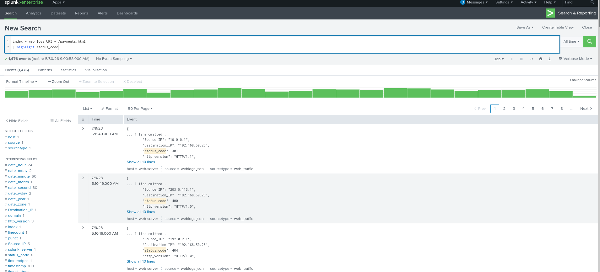

---

## Building a Baseline

Creating meaningful alerts requires establishing a baseline.

Without understanding what normal activity looks like, analysts risk generating excessive false positives.

The following query calculates the average number of hourly 404 responses.

### PAYLOAD

```spl
index=web_logs URI=/payments.html status_code=404
| bin _time span=1h
| stats count AS hits BY _time
| eventstats avg(hits) AS avg_hits
| eval avg_hits = round(avg_hits, 1)
```

### Explanation

Let's break this query down:

**bin _time span=1h**

Groups events into one-hour intervals.

**stats count AS hits BY _time**

Counts the number of 404 responses in each hour.

**eventstats avg(hits) AS avg_hits**

Calculates the average count across all hours.

**eval avg_hits = round(avg_hits,1)**

Rounds the average to one decimal place for readability.

The resulting baseline was approximately:

```text
7.6 HTTP 404 responses per hour
```

This value becomes the foundation for future detections.

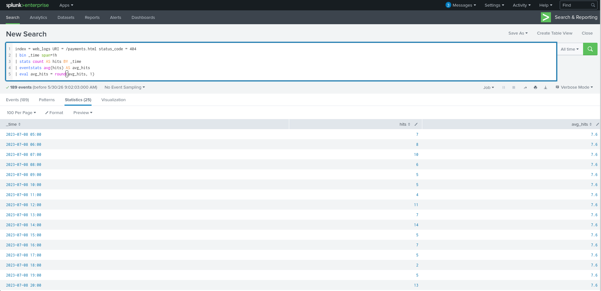

---

## Creating a Threshold Rule

Once a baseline has been established, we can identify abnormal activity by defining a threshold.

The room uses a threshold of **11 responses per hour**, which is significantly above the established average.

### PAYLOAD

```spl
index=web_logs URI=/payments.html status_code=404
| bin _time span=1h
| stats count AS hits BY _time
| where hits > 11
| eval alert = "HIGH 404s: ".hits." in 1h (normal: ~7.6/hr)"
```

### Explanation

This query:

- Groups events into one-hour intervals.
- Counts hourly 404 responses.
- Filters results exceeding 11 events.
- Generates a readable alert message.

Threshold-based detections are extremely common within SOC environments because they help distinguish normal behavior from suspicious spikes.

Potential causes include:

- Automated scanning
- Broken applications
- Misconfigured systems
- Active attacks

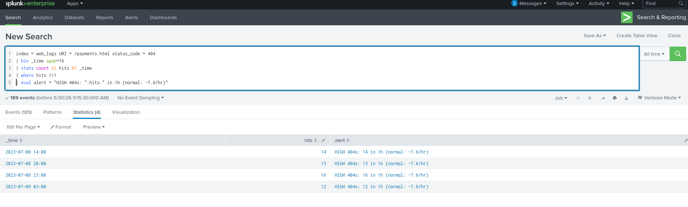

---

## Question 3

### How many Source_IP addresses outside the expected range accessed `/restricted.html`?

### Answer

```text
2
```

The query successfully identified two external systems accessing a resource that should typically remain internal.

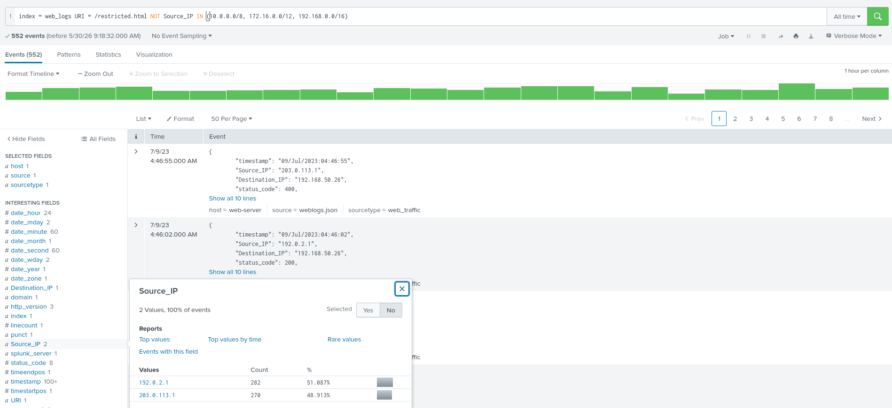

---

## Question 4

### How many total 404 status codes were recorded at `/payments.html`?

### Answer

```text
189
```

This value represents the total number of 404 responses generated by the payment page throughout the available dataset.

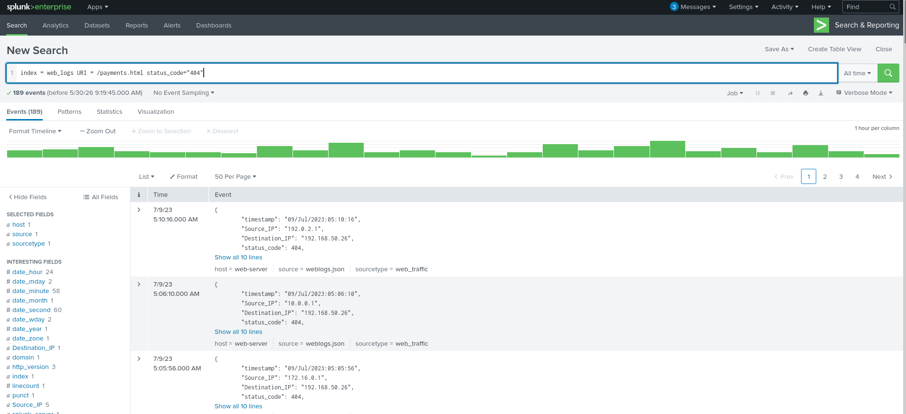

---

## Question 5

### What is the highest number of 404 responses received within a single hour?

### Answer

```text
16
```

This value represents the peak hourly volume of 404 responses observed during the analysis period.

Such spikes are exactly the type of behavior threshold-based alerts are designed to identify.

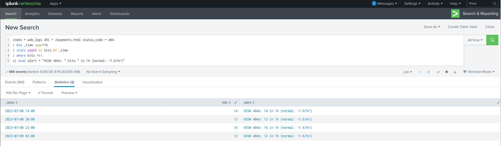

---

# Task 4 - Creating Dashboards for Summarizing Results

Dashboards provide analysts with a centralized view of important security data. Instead of repeatedly executing searches, dashboards display key metrics, trends, and visualizations that enable faster decision-making.

In a SOC environment, dashboards are commonly used to monitor:

- Authentication activity
- Incident volume
- Threat detections
- Web traffic
- Endpoint events
- Network activity

Splunk supports both **Classic Dashboards** and **Dashboard Studio**. In this room, we focus on Classic Dashboards because they remain widely used and support all major visualization types.

---

## Reviewing the Existing Dashboard

The room provides a dashboard called **Web Logs Overview**.

Initially, the dashboard contains only a basic visualization displaying event counts over time. While useful, additional panels can significantly improve visibility and provide more context about the underlying data.

The first step is entering edit mode and selecting **Add Panel**.

---

## Creating a URI Distribution Pie Chart

One of the easiest ways to understand web activity is by visualizing which pages receive the most traffic.

To achieve this, a pie chart can be created using the following search.

### PAYLOAD

```spl
index=web_logs
| stats count by URI
| sort - count
```

### Explanation

Let's break down the query:

**index=web_logs**

Searches all events from the web log dataset.

**stats count by URI**

Groups events based on URI and counts occurrences.

**sort - count**

Sorts results from highest frequency to lowest frequency.

The resulting visualization makes it easy to identify which resources are accessed most frequently and which resources receive little traffic.

This type of visualization is commonly used during:

- Web traffic analysis
- Application monitoring
- Threat hunting
- Resource utilization reviews

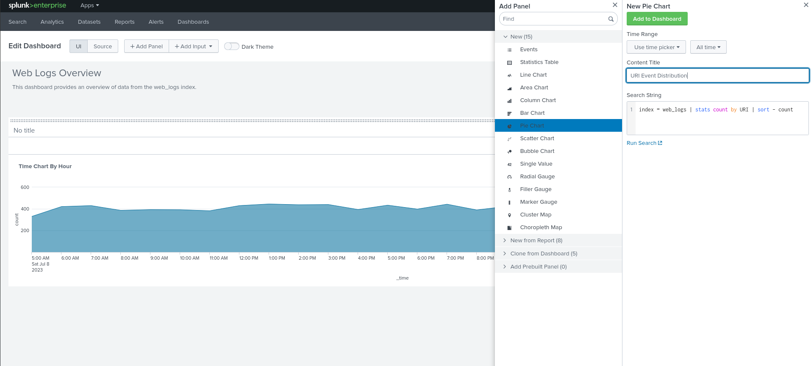

---

After adding the panel, Splunk generates the pie chart visualization.

The chart immediately provides a clearer understanding of traffic distribution compared to raw log entries.

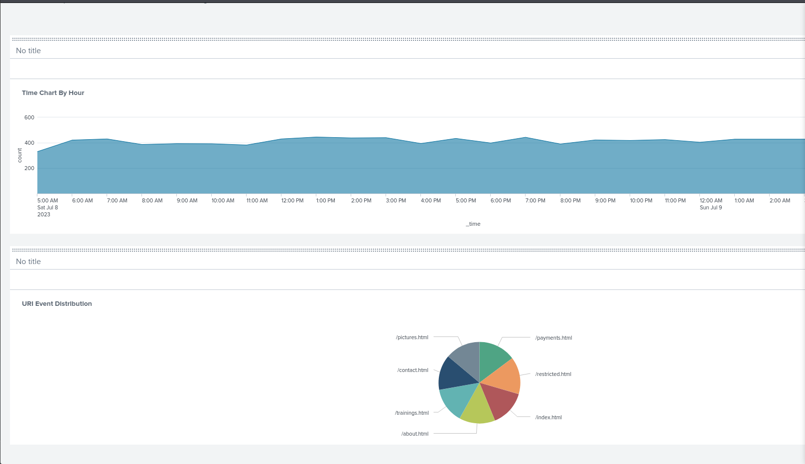

---

## Creating a Statistics Table for Restricted Resources

Earlier, we investigated the sensitive page:

```text
/restricted.html
```

A useful dashboard enhancement is displaying a breakdown of HTTP response codes associated with this resource.

### PAYLOAD

```spl
index=web_logs URI=/restricted.html
| stats count by status_code
| eventstats sum(count) as total
| eval percent = round(count * 100.0 / total, 2)
| sort - count
```

### Explanation

**index=web_logs URI=/restricted.html**

Filters events associated with the restricted resource.

**stats count by status_code**

Counts how many times each status code appears.

**eventstats sum(count) as total**

Calculates the total number of events.

**eval percent = round(count * 100.0 / total, 2)**

Computes the percentage represented by each status code.

**sort - count**

Sorts results from highest to lowest frequency.

This type of dashboard panel quickly answers questions such as:

- How many requests succeeded?
- How many requests failed?
- Are users encountering unusual errors?
- Is the page generating unexpected responses?

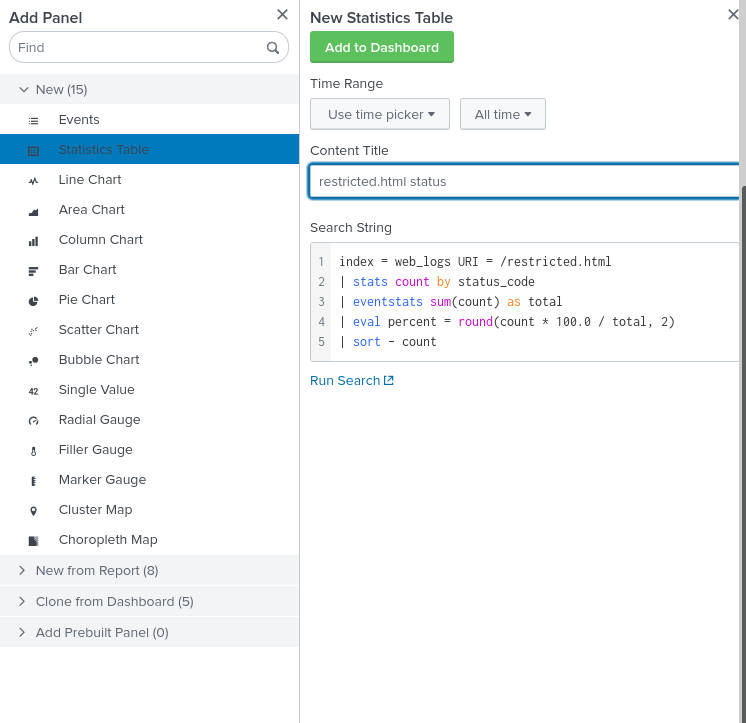

---

The completed statistics table provides a clear breakdown of response behavior and allows analysts to identify anomalies much faster than reviewing raw logs.

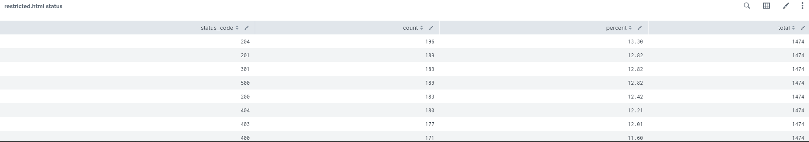

---

## Source IP Activity Analysis

A dashboard becomes even more useful when relationships between multiple fields can be visualized simultaneously.

The following query aggregates source IP addresses, requested URIs, and HTTP status codes.

### PAYLOAD

```spl
index=web_logs
| stats count by source_ip URI status_code
| sort - count
```

### Explanation

This query groups events based on:

- Source IP Address
- URI
- HTTP Status Code

The result helps analysts identify recurring communication patterns and determine which systems generate the highest volume of activity.

Common SOC use cases include:

- Identifying noisy hosts
- Detecting scanning activity
- Investigating suspicious clients
- Reviewing application usage trends

### Question

How many times did **172.16.0.1** receive a **200** response from **/payments.html**?

### Answer

```text
50
```

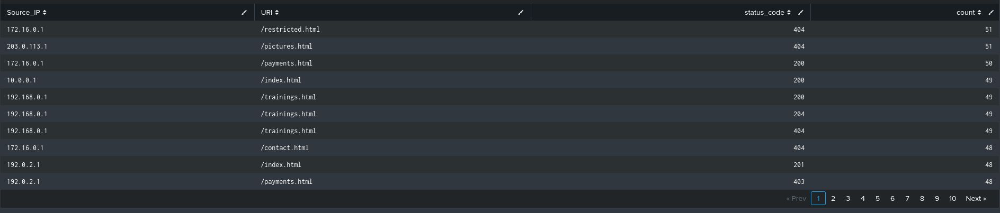

---

# Task 5 - Extending Splunk Functionality

Reports, alerts, and dashboards are powerful, but modern SOC operations require additional capabilities such as correlation, behavioral analytics, and automated response.

Splunk extends its functionality through several premium products that transform it from a log management platform into a comprehensive security operations ecosystem.

---

# Splunk Enterprise Security (ES)

Splunk Enterprise Security (ES) is Splunk's flagship security analytics platform.

Built on top of Splunk Enterprise, ES introduces:

- Correlation Searches
- Threat Intelligence Integration
- Risk-Based Alerting
- MITRE ATT&CK Mapping
- Incident Investigation Workflows
- Notable Events

Rather than simply displaying logs, ES provides context and prioritization, allowing analysts to focus on genuine threats.

---

## SOC Operations

One of the most useful ES features is **SOC Operations**.

SOC Operations provides visibility into:

- Team efficiency
- Alert workloads
- Analyst productivity
- Investigation throughput
- Operational bottlenecks

This enables managers and analysts to understand the overall health and performance of the SOC.

### Question

Which feature in Splunk Enterprise Security provides visibility into SOC efficiency and performance?

### Answer

```text
SOC Operations
```

---

## Correlation and Risk-Based Detection

Enterprise Security excels at connecting seemingly unrelated events.

Examples include:

- Multiple failed logins
- Suspicious PowerShell execution
- Threat intelligence matches
- Privilege escalation activity

Instead of treating these events individually, ES correlates them and generates meaningful security findings.

This significantly reduces alert fatigue and improves detection quality.

---

# Splunk UEBA

User and Entity Behavior Analytics (UEBA) focuses on behavioral analysis.

Traditional alerts often rely on fixed signatures or thresholds. UEBA takes a different approach by learning normal behavior and identifying deviations from that baseline.

---

## What UEBA Monitors

UEBA can analyze:

- User activity
- Workstations
- Servers
- Applications
- Authentication events
- Process execution

The platform continuously builds behavioral profiles and assigns risk scores based on anomalies.

Examples include:

- Unusual login locations
- Abnormal access times
- Suspicious file activity
- Privilege misuse
- Lateral movement indicators

---

## Risk Scoring

Instead of generating alerts for every event, UEBA aggregates behaviors and calculates risk scores.

This allows analysts to focus on high-risk users and systems rather than individual low-priority alerts.

A major advantage of UEBA is its ability to detect:

- Insider threats
- Compromised accounts
- Slow-moving attacks
- Behavioral anomalies

that may not trigger traditional detections.

---

# Splunk SOAR

SOAR stands for:

```text
Security Orchestration, Automation and Response
```

Formerly known as **Splunk Phantom**, SOAR introduces automation into incident response workflows.

Instead of requiring analysts to manually execute repetitive tasks, SOAR can automatically perform them using playbooks.

---

## What SOAR Can Automate

Examples include:

- Threat enrichment
- IP reputation checks
- Malware lookups
- Host isolation
- User account suspension
- Ticket creation
- Notification workflows

This dramatically reduces response times and improves consistency.

---

## Playbooks

Playbooks are the foundation of SOAR.

A playbook is a workflow containing:

- Conditions
- Filters
- Decisions
- Automated actions

Based on incoming security events, SOAR can dynamically decide what actions should be performed.

For example:

1. Alert received.
2. IP reputation checked.
3. If malicious:
   - Create incident.
   - Block IP.
   - Notify analysts.
4. If benign:
   - Close investigation.

This enables rapid, scalable incident response.

### Question

What does Splunk SOAR use to automate response actions based on conditions, filters, and decision logic?

### Answer

```text
Playbooks
```

---

# Why ES, UEBA, and SOAR Matter

Together, these technologies enable organizations to progress through the security maturity lifecycle:

| Capability | Purpose |
|------------|----------|
| Splunk Enterprise | Log collection and searching |
| Dashboards & Reports | Visibility and monitoring |
| Enterprise Security | Detection and investigation |
| UEBA | Behavioral analytics |
| SOAR | Automated response |

This combination provides a complete security operations workflow from data collection through incident response.

---

# Task 6 - Conclusion

In this room, I learned how Splunk can transform raw log data into actionable security insights.

Key concepts covered included:

- Creating recurring reports
- Building custom SPL searches
- Designing alerting logic
- Establishing baselines
- Creating threshold-based detections
- Building dashboards for visualization
- Understanding Enterprise Security
- Exploring UEBA analytics
- Learning SOAR automation concepts

The room demonstrates how modern SOC teams move beyond simple log searching and leverage Splunk to improve visibility, accelerate investigations, detect threats, and automate response activities.

By combining reports, alerts, dashboards, Enterprise Security, UEBA, and SOAR, Splunk becomes a complete platform for security monitoring and operations. 🔍

---

# Room Answers

| Question | Answer |
|-----------|---------|
| Highest Source_IP in Report | 10.0.0.1 |
| Hidden Flag | THM{splunk_report_wizard!} |
| External IPs Accessing /restricted.html | 2 |
| Total 404 Responses | 189 |
| Highest Hourly 404 Count | 16 |
| 172.16.0.1 → /payments.html → Status 200 | 50 |
| ES Feature for SOC Performance Visibility | SOC Operations |
| SOAR Automation Mechanism | Playbooks |

---

# Key Takeaways

Throughout this room, I gained practical experience with Splunk's core capabilities used daily in Security Operations Centers (SOCs).

### What I Learned

- Built recurring reports for efficient log analysis.
- Used SPL queries to aggregate and investigate large datasets.
- Created detection logic for suspicious activity.
- Learned how alerts can automate analyst notifications.
- Established baselines before defining thresholds.
- Implemented threshold-based detection rules.
- Designed dashboards for visualizing web traffic and security data.
- Explored the purpose of Splunk Enterprise Security (ES).
- Understood how UEBA identifies behavioral anomalies.
- Learned how SOAR automates incident response through playbooks.

### SOC Perspective

One of the biggest takeaways from this room is that effective detection is not just about searching logs. Modern SOC workflows require:

- Visibility through dashboards
- Context through correlation
- Detection through alerts
- Investigation through analytics
- Response through automation

Splunk brings all of these capabilities together, making it a powerful platform for both monitoring and incident response.

---

# Final Thoughts

This room provides a solid introduction to how security teams transform raw logs into meaningful detections, actionable insights, and automated response workflows.

While the lab focuses on foundational concepts, the same principles scale directly into real-world SOC environments where analysts continuously rely on reports, dashboards, alerts, and correlation rules to detect and investigate threats.

A strong understanding of these fundamentals is essential for anyone pursuing roles in:

- SOC Analysis
- Detection Engineering
- Threat Hunting
- Security Monitoring
- Incident Response

---

# 👋 Outro

If this walkthrough helped you, feel free to connect with me:

**GitHub:** https://github.com/AdityaBhatt3010

**LinkedIn:** https://www.linkedin.com/in/adityabhatt3010/

**Medium:** https://medium.com/@adityabhatt3010

More writeups soon — cleaner, deeper, and slightly unhinged 🗿🔥

If you found this useful, consider ⭐ starring my repositories and following my cybersecurity journey.

---
